##### Конфигурация:
 * nginx
 * php-fpm 7.3
 * mysql 5.6.40
***

##### Поддерживаемые версии magento 2:
 * 2.3
 * 2.4  
***

#### 1. Magento 2.
   1. Скачать magento 2:
      * С [офф. github репозитория](https://github.com/magento/magento2) и перейти на ветку потдерживаемой версии.
      * С любого другого ресурса, главное чтобы была поддерживаемая версия.
***

#### 2. Настройка Docker
   1. Установить Docker с [офф. сайта](https://docs.docker.com/install/),
      * `Для тех у кого linux` дополнительно установить docker-compose с [офф. сайта](https://docs.docker.com/compose/install/)
   2. В настройках Docker включить настройку **"Expose daemon on tcp://localhost:2375 without TLS"**. Включение этой опции 
   касается только Windows, на Linux включена по дефолту (если не включить эту опцию не будет возможности настроить дебагер),
   
      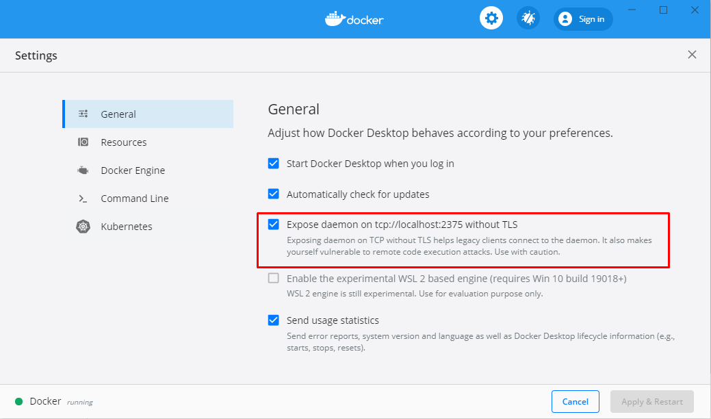
      
   3. Перезагрузить компьютер (для windows);
***

#### 3. Подготовка docker к запуску

   1. Подготовка инсталл файла (если хочешь устанавливать через web-wizard можешь пропустить этот шаг). В случае если ты перешел 
   к этому пункту уже после того как контейнеры были запущены после подготовки инсталл файла запусти комманду перезапуска контейнера php 
   в windows/linux консоли.
   
              docker restart magento2_php 
              
      * Файл **magento/m2install.php.dist** скопировать в ту же папку без префикса **.dist** (результат: **magento/m2install.php**);
      * В файле **magento/m2install.php** в свойство класса **\MagentoInstall::$requiredConfigurations** записать свой base_url в 
      массив (ключ массива **magento_base_url**). Протокол обязателен;
      
      Пример готового к установке установочного файла: 
      
      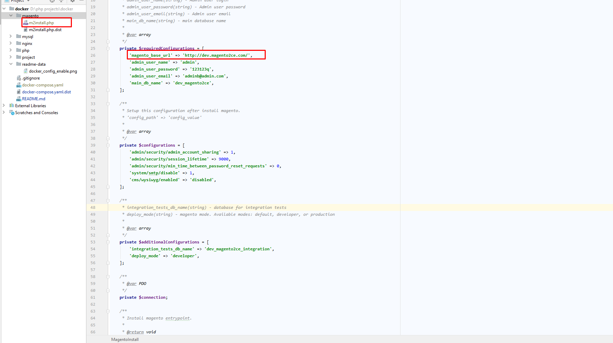
      
      * Все конфиги инсталлера можно менять на свое усмотрение. Доступные конфиги:
         * Свйоство **\MagentoInstall::$requiredConfigurations**;
         * Свйоство **\MagentoInstall::$storeConfigurations**;
         * Свйоство **\MagentoInstall::$additionalConfigurations**;
   2. Подготовка файла конфигурации nginx.
      * Файл **nginx/config/magento2.conf.dist** скопировать в ту же папку без префикса **.dist** (результат: **nginx/config/magento2.conf**);
      * В файле **nginx/config/magento2.conf** записать свой base_url без протокола вместо надписи **{Your host name}**;
      
      Пример готового файла конфигурации nginx:
      
      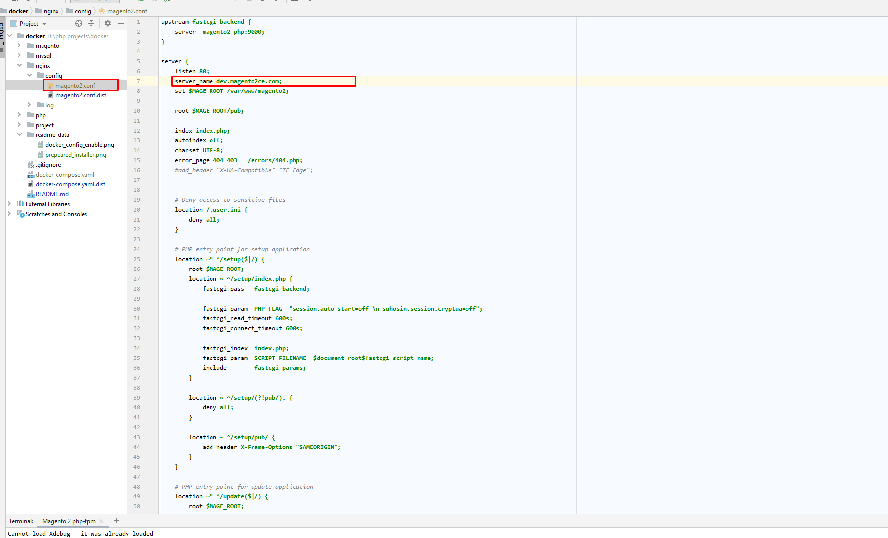
      
   3. Подготовка файла конфигурации докера.
      * Файл **docker-compose.yaml.dist** скопировать в ту же папку без префикса **.dist** (результат: **docker-compose.yaml**);
      * В файле **docker-compose.yaml** заменить **{Path to dir with project}** на полный путь к скачанному 
      проекту magento 2 из пункта 1.1 (**слэш в конце обязателен**);
      
      Пример готового файла конфигурации докера:
      
      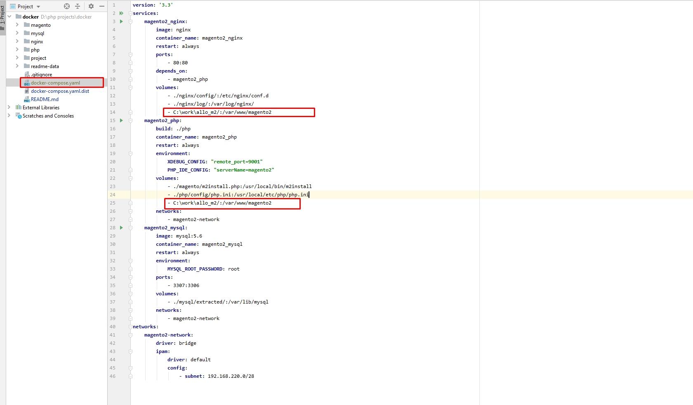
   
   4. В hosts файл добавить свой домен(base_url) по IP 127.0.0.1
      * Путь к файлу hosts на windows: _C:\Windows\System32\drivers\etc\hosts_
      * Путь к файлу hosts на linux: _/etc/hosts_
***

#### 4. Запуск docker.
   1. В консоли windows/linux перейти в папку проекта docker,
   2. Выполнить комманду
   
          docker-compose up -d
   
      и дожидаться полного её выполнения,
   3. Выполнить комманду
          
          docker ps -a
      результатом должен быть грид в котором минимум 3 контейнера из этого проекта: **magento2_nginx**, **magento2_mysql** и **magento2_php**
      и статус каждого _"Up ..."_
      
      Пример выполнения комманды "docker ps -a": 3 контейнера в статусе _"Up ..."_:
      
      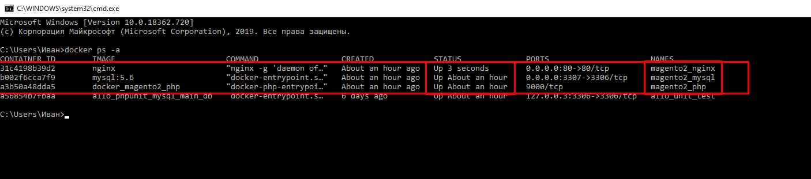
      
      теперь сервер доступен по IP 127.0.0.1 порт 80, mysql доступен по IP 127.0.0.1 и порту 3307 
***
      
#### 4. Установка/переустановка magento 2 (2 варианта).
   1. Установка через web-wizard.
      * Если magento уже установлена нужно:
         * Удалить файл **app/etc/env.php** в репозитории magento
         * Почистить кеш удалив из папки var в репозитории magento все кроме .htaccess.
      * Установить компоузер (выполнить пункт 6.5)   
      * Зайти в браузере по URL указанному в настройках(base_url) и пройти все этапы установки.
      
        Примечания:
         * Предварительно нужно создать базу данных с удобным для себя именем;
            * _1 вариант:_ подключится к базе данных через любой менеджер БД по IP 127.0.0.1 и порту 3307 и создать базу в нем;
            * _2 вариант:_  подключится к контейнеру mysql и выполнить создание БД там
               * Для подключения к консоли контейнера mysql выполняем комманду
               
                        docker exec -it magento2_mysql /bin/bash
                        
               * Выполняем стандартное подключение к mysql (логин: root, пароль: root)
               
                         mysql -u root -proot
                         
               * Создаем базу с своим именем
               
                         create database <your database name>;
                         
               * Для выхода можно закрыть консоль или выйти из mysql запросом _"exit;"_ и потом из контейнера коммандой _"exit;"_.
               
         * При установке, в пункте где просит DB host нужно указать **magento2_mysql**;
         
   2. Установка через файл инсталлера (для этого варианта пункт 3.1 обязателен к выполнению).
      * Если magento уже установлена файл удалит app/etc/env.php, var/*. pub/static/*, generated/*, vendor/* и заного все установит
      * Если файл инстала подготовлен запустить команду в windows/linux консоли:
      
                docker exec -it magento2_php php /usr/local/bin/m2install
      
      должна начать установка, после которой можно заходить в браузер по URL указанному в настройках(base_url).
***
      
#### 5. Настройка xdebug (предполагается что все контейнеры запущены).
   1. В файле **php/config/php.ini**, в репозитории докера, правильно прописать _xdebug.remote_host_.
      * Для windows _xdebug.remote_host_ должен быть равен **host.docker.internal**
      * Для linux _xdebug.remote_host_ должен быть равен **192.168.220.1**
      
      Пример для настройки для windows
      
      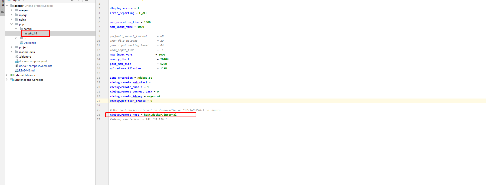
      
   2. Перейти в **"File" -> "Settings"** или комбинация **Ctrl + Alt + S**
      * Настройка _"Languages & Frameworks"_
         * _PHP_
            * PHP language level: 7.3
            * CLI interpreter нажать "..."
            
            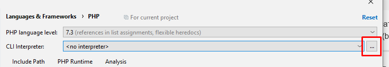
            
            * в появившемся окне нажать "+" после чего выбрать **"From Docker, Vagrant, VM..."**
            
            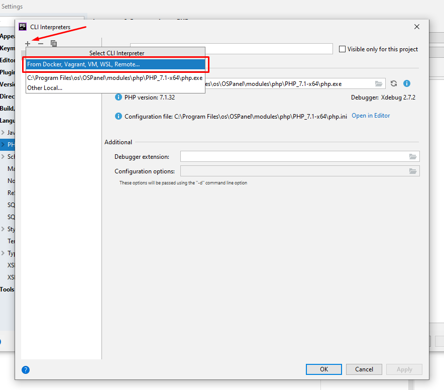
            
            * Должно открыться окно _"Configure Remote PHP Interpreter"_, в нем выбираем "Docker Compose"
            
            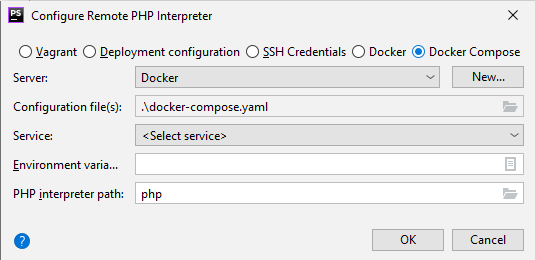
            
            * В пункте "Server" нажать "New...", в появившемся окне **name** прописать **magento2**, выбрать **TCP socket** 
            и прописать **Engine API URL**: **tcp://localhost:2375** после чего нажать OK.
            
            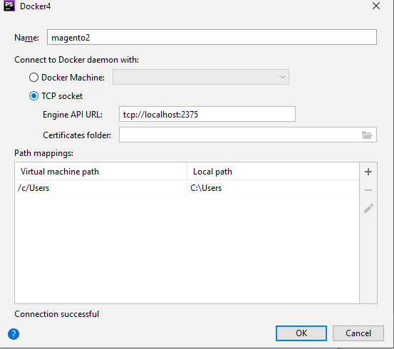
            
            * В окне _"Configure Remote PHP Interpreter"_ в пункте "Configuration file(s)" выбрать docker-compose.yaml который лежит в корне проекта докера.
            * В окне _"Configure Remote PHP Interpreter"_ в пункте "Service" выбрать "magento2_php".
            * В окне _"Configure Remote PHP Interpreter"_ нажать ОК
            
            Готовое окно _"Configure Remote PHP Interpreter"_ выглядит вот так:
            
            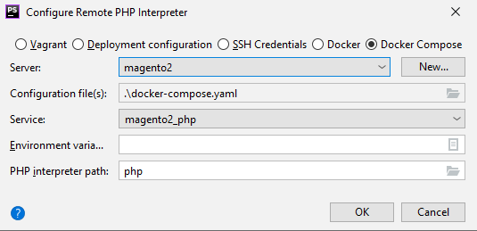
            
            * Если в окне _"Configure Remote PHP Interpreter"_ все зделано верно то в окне "CLI interpreters" должна отображаться
            версия PHP и версия xdebug.
            
            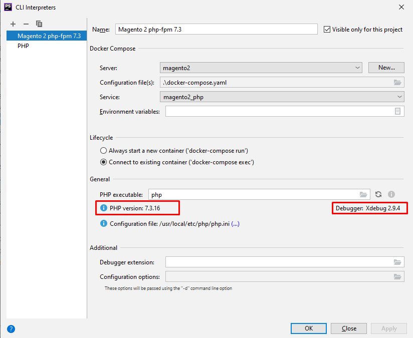
            
            * Далее нужно все поля выделенные красным привести к виду из скриншота и нажать **"Apply" -> "OK"** 
            
            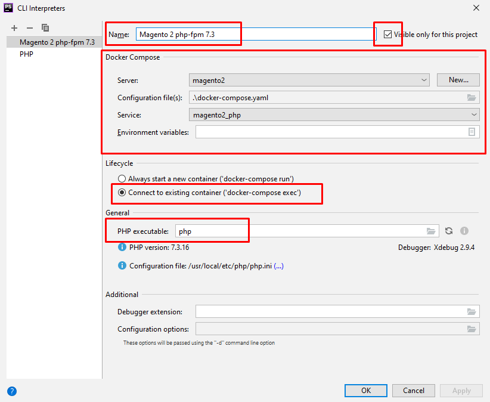
            
            * После нажатия "ОК" убедись что выбран именно настроенный интерперетатор
            
            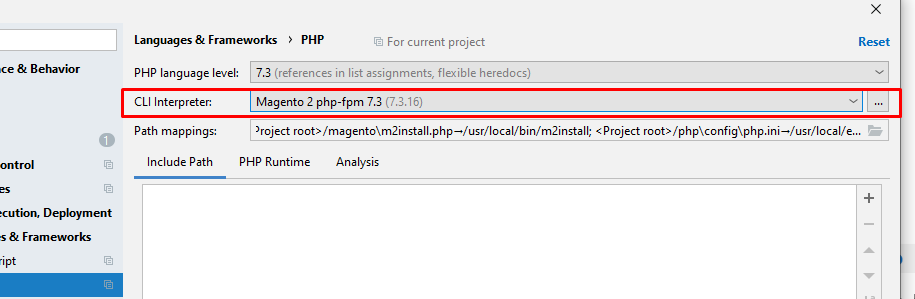
            
         * _Debug_
            * Порт указать 9001 и включить "Can accept external connections".
            
            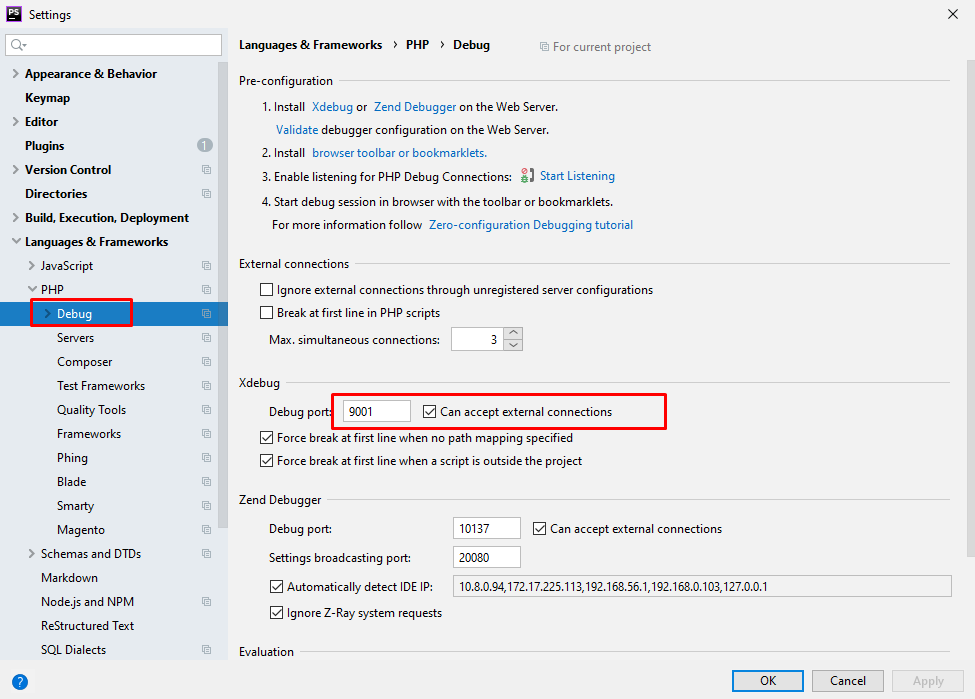
            
         * Servers
            * Нажать на "+" добавив тем самым новый сервер,
               * **"Name"** указать **"magento2"**
               * **"Host"** указать **base_url без протокола**
               * **"Port"** указать **"80"**
               * **"Debugger"** указать **"xdebug"**
               * Включить **"Use path mappings"** и прилинковать к твоему проекту папку из php контейнера docker **"/var/www/magento2"**
               
            Готовый сервер должен выглядеть так (кроме host)
            
            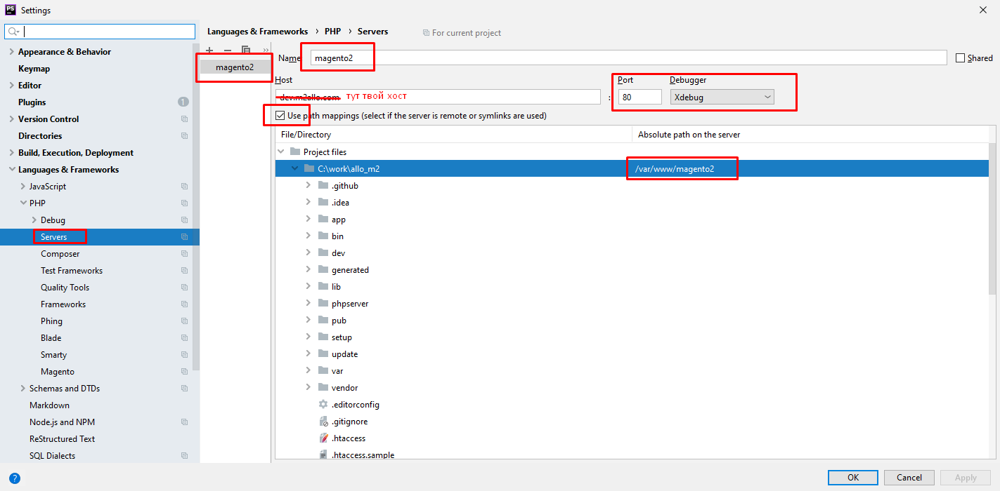
***            

#### 6. Основные команды Docker (запускаются из консоли windows/linux)

   1. Посмотреть список запущеных контейнеров
   
            docker ps
            
   2. Остановить все контейнеры (нужно перейти в папку где лежит docker-compose.yaml)
   
            docker-compose down
            
   3. Запустить все контейнеры (нужно перейти в папку где лежит docker-compose.yaml)
   
            docker-compose up -d
            
   4. Перейти в консоль контейнера (нужно знать имя контейнера которое можно взять выполнив п. 6.1 "docker ps")
            docker exec -it имя_контейнера /bin/bash
            
   5. Установить компоузер (настроено так что по умолчание контейнер запускает находясь в папке /var/www/magento2)
   
            docker exec -it magento2_php composer install
            
   6. Выполнение команд bin/magento нужно зайти в контерйнер PHP и выполнить их там "php bin/magento ..." или выполнить команду
   с windows/linux консоли:
   
            docker exec -it magento2_php php bin/magento cache:flush
   
   7. Рестарт контейнера (нужно знать имя контейнера которое можно взять выполнив п. 6.1 "docker ps")
   
            docker restart имя_контейнера
            
   8. Удалить неиспользуемые контейнеры
   
            docker container prune
            
   9. Удалить неиспользуемые image
   
            docker image prune
            
   Все остальные команды (которых ~~пи-ец~~ достаточно много, гуглите ...)
***
      
###### _В случае ошибок или возникновения вопросов обращаться ко мне (Иван Плетнев), будет время помогу (но это не точно)._

###### _Все права незащищены :(_